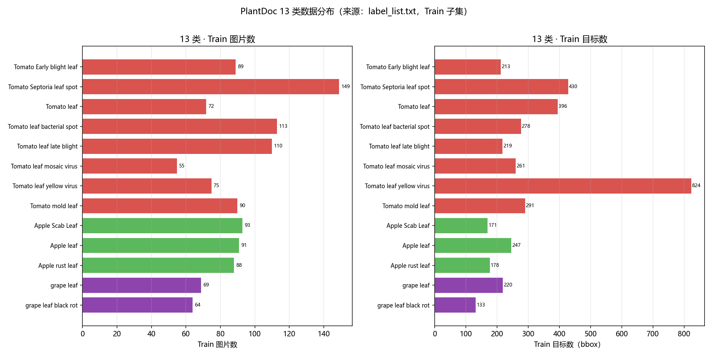
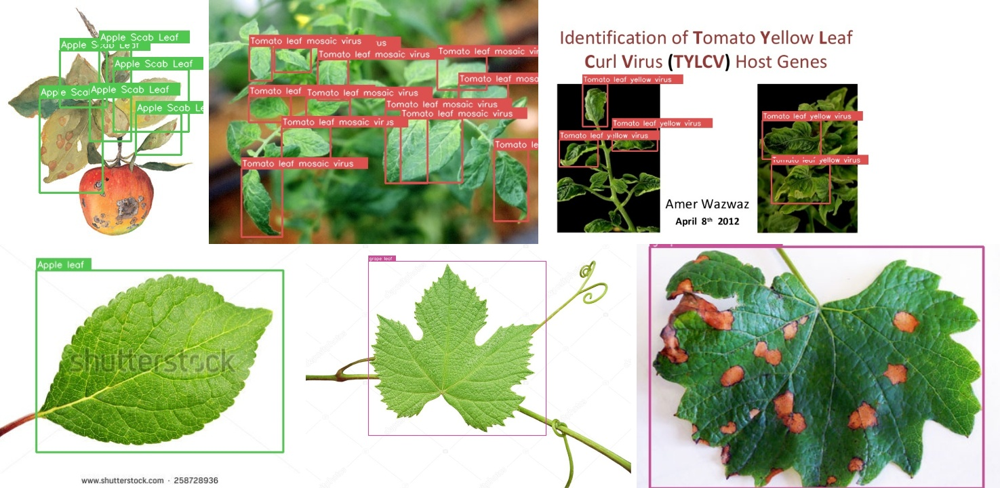
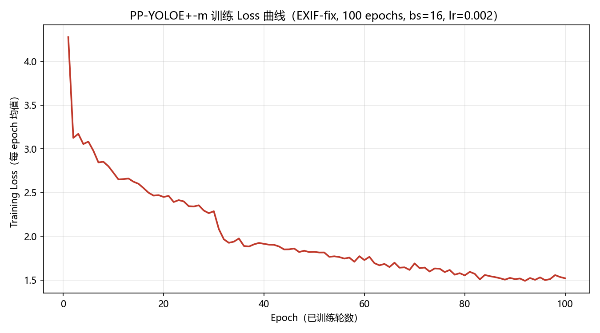
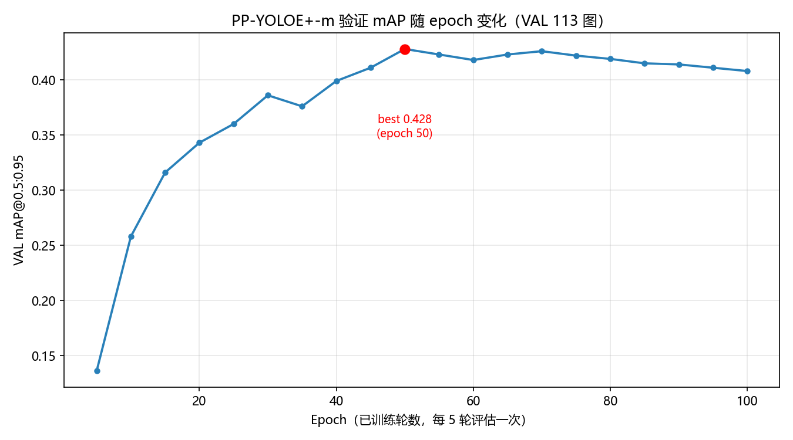
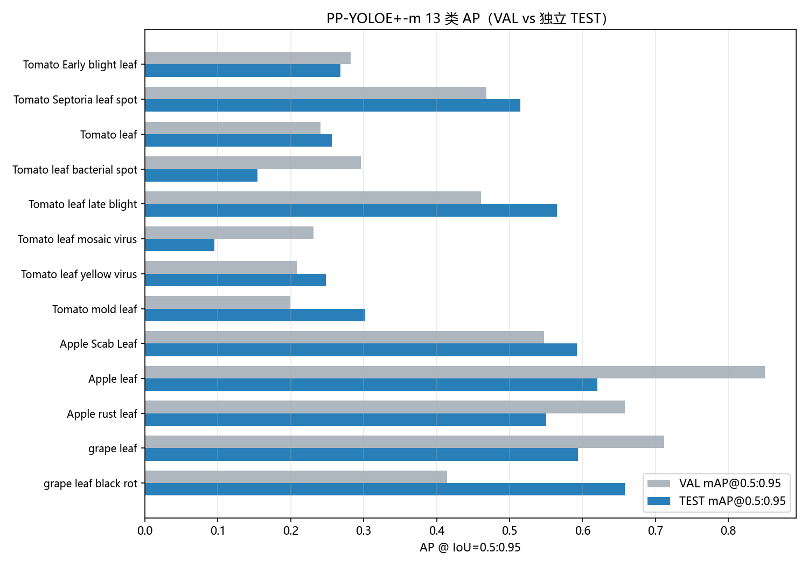
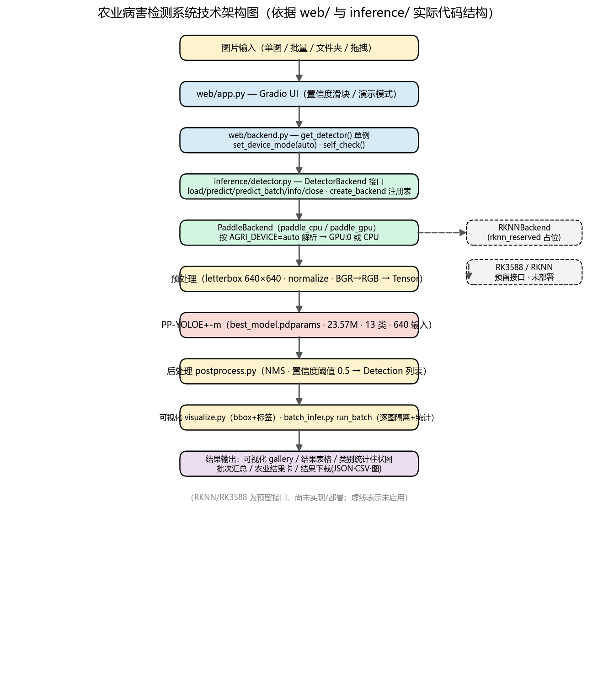
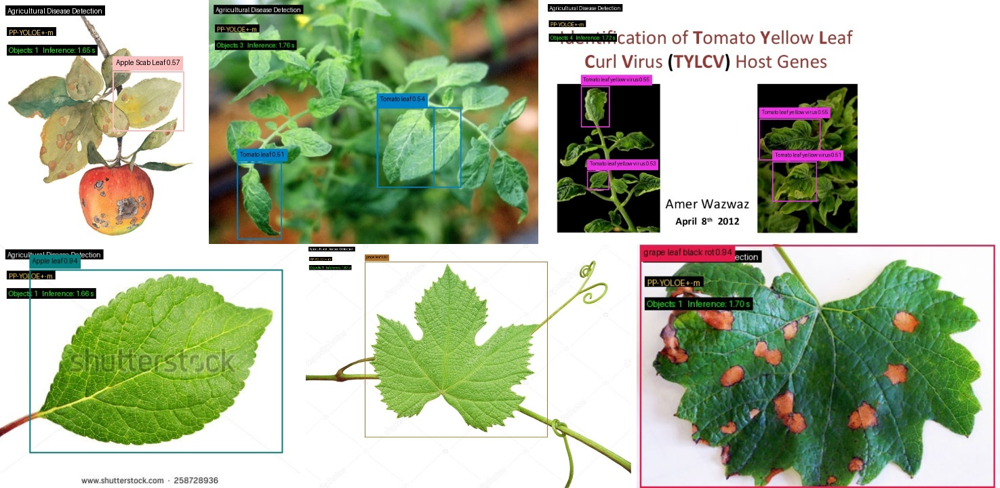

# AIC2026_AgriVision —— AI 农业病害智能检测系统 项目技术说明书

> **文档性质**：正式《项目技术说明书》
> **生成时间**：2026-08-18
> **数据依据**：本文全部实验数据均取自项目事实库（`PROJECT_FINAL_FACTS.md` 已确认数据），并逐项对应原始实验/验证报告；**未虚构、未修改、未协调任何冲突数据**。
> **图片目录**：本文引用的图均位于 `docs/assets/`（相对路径 `assets/`）。
> **口径说明**：本文严格区分 VAL / TEST、CPU / GPU、单图 / 批量、Web / 命令行、评估循环 / 推理流水线等不同实验口径，FPS 数值不混用。

---

## 目录

1. 项目概述
2. 项目背景与需求
3. 总体技术方案
4. 数据集与数据处理
5. PP-YOLOE+-m 模型与训练方案
6. 模型验证与实验结果
7. CPU / GPU 推理性能对比
8. Web 智能检测平台设计
9. 系统功能与农业病害应用场景
10. 系统架构与 Backend 设计
11. 比赛演示案例
12. RK3588 后续部署规划
13. 项目优势与创新点
14. 当前局限与后续工作
15. 项目总结

---

## 1. 项目概述

本项目面向 AIC2026 农业视觉（AgriVision）目标检测任务，构建了一套以 **PP-YOLOE+-m 目标检测模型** 为核心的 **AI 农业病害智能检测系统**，实现对番茄、苹果、葡萄三类主要作物 **13 类叶部病害/健康状态** 的自动检测与可视化。

系统覆盖「数据集处理 → 模型训练与消融 → 独立验证 → 多后端推理 → Web 展示」的完整闭环，交付了可直接运行、可演示的 Gradio Web 平台，并预留了 RK3588 边缘部署接口。

**项目关键指标一览（均已实测确认）：**

| 项 | 值 |
|---|---|
| 最终模型 | PP-YOLOE+-m（depth_mult=0.67, width_mult=0.75） |
| 参数量 / 模型大小 | 23.57M / 94.3 MB |
| 训练轮数 | 100 epoch |
| VAL mAP@0.5:0.95（选模型依据） | **0.428** |
| 独立 TEST mAP@0.5:0.95 | **0.417** |
| GPU 批量推理 FPS（8 张 VAL，RTX 4090） | **12.84** |
| Web 端 GPU 批量 FPS（8 张 VAL） | **12.00** |
| CPU 批量推理 FPS（8 张 VAL） | **0.42** |
| 15 张比赛演示案例 | **15/15 成功** |

---

## 2. 项目背景与需求

### 2.1 背景

农作物叶部病害的早期、准确识别是精准农业与植保决策的重要基础。传统人工识别依赖专家经验，存在主观性强、效率低、难以大规模推广等问题；而基于深度学习的目标检测技术能够自动定位叶片上的病斑区域并给出类别判断，是农业智能化的重要方向。

### 2.2 需求与挑战

结合本项目数据集的诊断分析（`baseline_v1/BASELINE_DIAGNOSTIC_REPORT.md`、`direction3/DIRECTION3_DIAGNOSTIC.md`、`direction4/DIRECTION4_DIAGNOSTIC.md`），任务面临的主要技术难点包括：

1. **小样本与类别不平衡**：整体训练集约 915 张图，且各类目标数量差异大（最少的葡萄黑腐病约 133 个目标，最多的番茄黄化病毒约 824 个目标）。
2. **细粒度类间混淆**：番茄类内多种病害（早疫病、斑枯病、晚疫病、细菌性斑点病等）病灶形态相似，易相互误判。
3. **密集场景漏检**：单图目标数较多时（≥10 个），模型置信度被整体压低，导致高阈值下漏检。
4. **数据质量问题**：原始数据存在 EXIF 旋转方向信息与实际像素不一致的情况，直接训练会造成像素与标注框错位。

这些挑战构成了本项目在数据、模型、验证三个层面的攻关方向。

---

## 3. 总体技术方案

项目采用「**数据质量修复 → 官方结构严格基线 → 受控消融实验 → 容量放大定模型 → 多后端推理与 Web 交付**」的总体路线：

1. **数据层**：基于 PlantDoc 公开目标检测数据集，完成 13 类划分与数据清洗，并对 EXIF 旋转异常图做像素烘焙修复，形成最终锁定数据集 `processed_detection_exiffix`。
2. **模型层**：以官方 PP-YOLOE+ 结构为基线，经过严格的单变量消融实验（EXIF 修复、混淆引导损失、类加权损失、密度感知校准、辅助监督、预训练等方向），最终确定 **PP-YOLOE+-m**（medium 容量）为最终模型。
3. **验证层**：以 **VAL（113 张）** 作为唯一模型选择依据，**TEST（114 张）** 仅做一次独立泛化评估，全程封闭，避免数据泄漏。
4. **交付层**：实现 CPU / GPU 双后端统一推理接口，交付 Gradio Web 检测平台与 15 张比赛演示案例，并预留 RK3588 边缘后端接口。

---

## 4. 数据集与数据处理

### 4.1 数据集来源

| 项 | 内容 |
|---|---|
| 数据集 | PlantDoc 目标检测数据集（3 作物 / 13 类 / 1144 图 / 3861 目标） |
| 官方仓库 | `github.com/pratikkayal/PlantDoc-Object-Detection-Dataset` |
| 论文出处 | "PlantDoc: A Dataset for Visual Plant Disease Detection"（CoDS-COMAD 2020） |
| 许可证 | CC-BY-4.0 |

> 注：PlantVillage、IP102 等外部数据集在本项目中仅做过迁移可行性审计，最终模型**未使用**这些外部数据训练。

### 4.2 13 类定义

数据集共 13 类（番茄 8 类、苹果 3 类、葡萄 2 类），类别列表（模型输出顺序 0–12）如下：

| id | 类别 | 作物 | 性质 |
|---|---|---|---|
| 0 | Tomato Early blight leaf | 番茄 | 病害 |
| 1 | Tomato Septoria leaf spot | 番茄 | 病害 |
| 2 | Tomato leaf | 番茄 | 健康 |
| 3 | Tomato leaf bacterial spot | 番茄 | 病害 |
| 4 | Tomato leaf late blight | 番茄 | 病害 |
| 5 | Tomato leaf mosaic virus | 番茄 | 病害 |
| 6 | Tomato leaf yellow virus | 番茄 | 病害 |
| 7 | Tomato mold leaf | 番茄 | 病害 |
| 8 | Apple Scab Leaf | 苹果 | 病害 |
| 9 | Apple leaf | 苹果 | 健康 |
| 10 | Apple rust leaf | 苹果 | 病害 |
| 11 | grape leaf | 葡萄 | 健康 |
| 12 | grape leaf black rot | 葡萄 | 病害 |

### 4.3 数据划分

| 数据集版本 | train | val | test |
|---|---|---|---|
| 原始 processed_detection | 916 图 / 3084 标注 | 114 图 / 354 标注 | 114 图 / 423 标注 |
| **EXIF-fix（最终锁定）** | **915 图 / 3079 标注** | **113 图 / 350 标注** | **114 图 / 423 标注** |

### 4.4 数据质量处理：EXIF 旋转修复

原始数据中存在 11 张 EXIF 旋转方向（Orientation 6/8）与实际像素不一致的图片，直接训练会导致像素与标注框错位。本项目在独立副本上执行**像素烘焙修复**（将像素旋转到显示方向），并在消融实验中验证该修复带来稳定提升，最终将其作为后续所有实验的数据基础。TEST 分片全程未改动。

**图4-1 PlantDoc 13 类数据分布（Train 子集，左：图片数；右：目标数；数据来源 `label_list.txt`）**

**图4-2 数据集样例与 GT 标注框可视化（VAL 子集，覆盖番茄/苹果/葡萄与单目标/多目标/密集场景；单张见 `assets/dataset_sample_01~06_*.jpg`）**

---

## 5. PP-YOLOE+-m 模型与训练方案

### 5.1 模型结构

| 项 | 内容 |
|---|---|
| 架构 | PP-YOLOE+-m：官方 CSPResNet 骨干 + CustomCSPPAN 颈部 + PPYOLOEHead 检测头 |
| 规模参数 | depth_mult=0.67, width_mult=0.75 |
| 预训练权重 | Objects365-m（`ppyoloe_crn_m_obj365_pretrained.pdparams`） |
| 参数量 | 23,568,416（**23.57M**） |
| 模型大小 | **94.3 MB**（fp32 pdparams） |
| 输入尺寸 | 640×640（训练多尺度 320~768） |

最终模型**采用官方 PP-YOLOE+ 结构，零自定义算法模块**；性能提升来源于数据质量修复与模型容量放大，而非引入新的网络组件。

### 5.2 训练环境与超参数

| 项 | 内容 |
|---|---|
| 训练平台 | AutoDL Linux，NVIDIA RTX 4090（24 GB） |
| 深度学习框架 | PaddlePaddle 2.6.2（cu118）+ PaddleDetection v2.9.0 |
| Python | 3.12.3 |
| 训练轮数 | **100 epoch** |
| batch_size（实际） | 16（命令行 `-o` 覆盖，配置默认 8） |
| base_lr（实际） | 0.002（按 batch 线性缩放） |
| 学习率调度 | CosineDecay(100) + LinearWarmup(5) |
| EMA | 开启（0.9998） |
| 训练耗时 | ≈2.5 小时 |
| 训练显存峰值 | ≈20.3 GB / 25.9 GB |

### 5.3 消融驱动的模型选型

项目先后开展多个受控消融方向：数据清洗、EXIF 修复、混淆引导分类损失（CGPM）、类加权 VFL、密度感知校准、图像级分类辅助监督（CG-ACS）、PlantVillage 分类预训练等。经严格判据（相对基线 VAL mAP 提升 ≥ +0.005 且无强类回退）筛选：

- **EXIF 修复**被验证有效，成为后续数据基础；
- **模型容量放大（PP-YOLOE+-s → PP-YOLOE+-m）是唯一获得稳定精度增益的方向**，最终据此选定 PP-YOLOE+-m；
- 其余方向均未达判据，已归档、不再采用（详见事实库 `PROJECT_EXPERIMENT_INDEX.md`）。

**图5-1 PP-YOLOE+-m 训练 Loss 随 epoch 变化曲线（100 epochs，逐 epoch 均值；数据来源 `formal_train.out`）**

**图5-2 PP-YOLOE+-m VAL mAP@0.5:0.95 随 epoch 变化（每 5 轮评估一次，best=0.428@epoch50）**

---

## 6. 模型验证与实验结果

### 6.1 验证协议

- **模型选择依据 = VAL（113 张）**：仅用 VAL 选择 best checkpoint。
- **TEST（114 张）为独立泛化评估**：仅在最终模型确定后执行一次，**未参与任何选择、调参或重训**，全程封闭。

### 6.2 最终指标（VAL 与独立 TEST）

| 指标 | VAL（选模型用） | TEST（独立评估） |
|---|---|---|
| **mAP@0.5:0.95** | **0.428** | **0.417** |
| mAP@0.5 | 0.590 | 0.601 |
| mAP@0.75 | 0.492 | 0.475 |
| AP small / medium / large | — | 0.408 / 0.294 / 0.444 |
| AR@1 / AR@10 / AR@100 | — / — / 0.723 | 0.264 / 0.598 / 0.686 |
| Precision / Recall / F1（conf=0.5） | — | 0.685 / 0.452 / 0.544 |
| 密集场景 Recall（10 图 / 137 GT） | — | 0.372 |

TEST mAP@0.5:0.95 = **0.417** 与 VAL 0.428 相差 −0.011，处于 113/114 张小样本的合理波动区间，无强类系统性回退，独立确认了模型的泛化能力。

### 6.3 13 类 AP 结果

| 类别 | VAL AP | TEST AP |
|---|---|---|
| Tomato Early blight leaf | 0.282 | 0.268 |
| Tomato Septoria leaf spot | 0.468 | 0.515 |
| Tomato leaf | 0.241 | 0.256 |
| Tomato leaf bacterial spot | 0.296 | 0.154 |
| Tomato leaf late blight | 0.461 | 0.565 |
| Tomato leaf mosaic virus | 0.231 | 0.095 |
| Tomato leaf yellow virus | 0.208 | 0.248 |
| Tomato mold leaf | 0.199 | 0.302 |
| Apple Scab Leaf | 0.547 | 0.592 |
| Apple leaf | 0.850 | 0.620 |
| Apple rust leaf | 0.658 | 0.550 |
| grape leaf | 0.712 | 0.594 |
| grape leaf black rot | 0.414 | 0.658 |

**图6-1 PP-YOLOE+-m 13 类 AP 对比（VAL vs 独立 TEST；数据来源 `M_FINAL_TEST_REPORT.md` §3.3/§5.3）**

> 说明：苹果/葡萄等强类 AP 较高（如葡萄黑腐病 TEST 0.658、苹果疮痂病 0.592）；番茄类内相近病灶（早疫/斑枯/晚疫/细菌性斑点）与弱类（花叶病、黄化病）在小样本下波动较大，为主要误差来源。

---

## 7. CPU / GPU 推理性能对比

> **重要口径说明**：下表 FPS 数值来自不同实验场景，**不可混用**。请按「设备 + 图片数 + 运行方式」三要素理解每个数字。

| 场景 | 设备 / 后端 | 图片数 | FPS | 说明 |
|---|---|---|---|---|
| 模型评估（eval 循环） | RTX 4090 / paddle_gpu | 114 张（TEST） | **16.6** | `tools/eval.py` 评估口径 |
| 批量推理 | RTX 4090 / paddle_gpu | 8 张 VAL | **12.84** | `run_batch` 引擎，预热后稳态，含读图/推理/后处理/落盘 |
| Web 批量检测 | RTX 4090 / paddle_gpu | 8 张 VAL | **12.00** | Web 实际运行计时 |
| 单图推理（冷启动） | RTX 4090 / paddle_gpu | 1 张 VAL | **1.96** | 含 GPU 内核首次初始化 |
| Web 单图检测 | RTX 4090 / paddle_gpu | 1 张 VAL | 1.31 | Web 实际运行计时 |
| 批量推理 | Windows CPU / paddle_cpu | 8 张 VAL | **0.42** | 本地 CPU，18.84 s |
| 演示批量 | Windows CPU / paddle_cpu | 15 张 VAL | 0.59 | 25.46 s |

**CPU / GPU 对比（同 8 张 VAL 图、同引擎、同阈值 0.5）**：GPU 批量 FPS 12.84 约为 CPU 批量 FPS 0.42 的 **约 30 倍**；且 GPU 与 CPU 逐目标检测结果一致（目标数 11 = 11，逐目标 bbox 一致，最大置信度差 0.000175、最大 bbox 差 0.04 px），确认了后端切换不改变检测正确性。

---

## 8. Web 智能检测平台设计

本项目基于 **Gradio 6.24.0** 构建了可交互的 Web 检测平台，将已训练好的 PP-YOLOE+-m 模型封装为在线检测服务。

**平台能力**：
- **模型只加载一次**（单例 `get_detector()`），多次请求复用同一模型实例；
- **设备自动选择**：`AGRI_DEVICE=auto` 时自动解析 GPU 或 CPU 后端（GPU 可用时用 `paddle_gpu/gpu:0`，否则回退 `paddle_cpu`）；
- **置信度阈值滑块**：对检测结果产生真实过滤作用（0.05→128 目标、0.5→1 目标、0.9→0 目标）；
- **结果展示**：可视化检测框、结果表格、类别统计柱状图、批次汇总；
- **结果下载**：JSON / CSV / 检测图一键下载；
- **异常处理**：损坏图片失败隔离、无目标空状态、友好中文提示。

> **系统界面截图（待补充）**：本说明书撰写时，仓库内尚无真实运行截图。为避免伪造界面，此处预留位置，待正式展示环境启动 Web 后补充。

**图8-1 系统界面截图（主界面 / 检测结果 / 类别统计 / 农业场景 / 演示模式）——〔占位，待补充真实截图〕**

---

## 9. 系统功能与农业病害应用场景

### 9.1 功能清单

| # | 功能 | 状态 |
|---|---|---|
| 1 | 单图 / 批量 / 文件夹 / 拖拽上传 | ✅ |
| 2 | 置信度阈值滑块（真实过滤） | ✅ |
| 3 | 检测结果可视化（bbox + 类别 + 置信度） | ✅ |
| 4 | 检测结果表格与类别统计 | ✅ |
| 5 | 批次汇总（总耗时 / 平均 / FPS） | ✅ |
| 6 | 结果下载（JSON / CSV / 图） | ✅ |
| 7 | 农业病害场景卡片（番茄/苹果/葡萄） | ✅ |
| 8 | 15 张比赛演示模式 | ✅ |
| 9 | 损坏图片失败隔离 / 无目标状态 | ✅ |
| 10 | 模型单例加载 | ✅ |

### 9.2 农业病害应用场景

系统面向番茄、苹果、葡萄三类作物的叶部病害检测，在每次检测后动态生成「🌱 农业视觉检测结果」卡片，展示场景类型、作物类别、检出病害类别、目标数与置信度，并**明确标注免责声明**：「以上为 AI 视觉检测结果，不等同于专业植保诊断」。系统不使用「确诊 / 治疗方案」等表述，不根据置信度虚构病害严重程度或经济损失。

---

## 10. 系统架构与 Backend 设计

### 10.1 整体数据流

「图片上传 → Web（Gradio UI）→ DetectorBackend 统一接口 → PaddleBackend（GPU/CPU）→ 预处理 → PP-YOLOE+-m 推理 → 后处理 → 可视化 / 统计 / 结果下载」，具体见下图。

**图10-1 系统技术架构图（依据 `web/` 与 `inference/` 实际代码结构绘制；RKNN/RK3588 为虚线预留接口，尚未部署）**

### 10.2 Backend 统一抽象

| 项 | 内容 |
|---|---|
| 统一接口 | `DetectorBackend`（load / predict / predict_batch / info / close） |
| 已注册后端 | `paddle_cpu`、`paddle_gpu`（PaddleBackend）+ `rknn_reserved`（RKNNBackend 占位） |
| 解耦边界 | Web/UI 仅依赖 DetectorBackend 接口与 Detection 结构，不依赖 Paddle 私有实现 |

该设计使得推理后端可插拔：切换 CPU/GPU 无需改动 Web 层，未来新增 RKNN 后端只需实现 `RKNNBackend(DetectorBackend)` 并在注册表注册，**无需改动 Web / 后处理 / 可视化 / 统计代码**。

---

## 11. 比赛演示案例

项目准备了 **15 张比赛演示案例**（全部来自 VAL 子集，未使用 TEST），覆盖番茄 8 例、苹果 4 例、葡萄 3 例，含单目标 9 例、多目标 5 例、密集场景 1 例，类别覆盖 12/13 类。

| 项 | 结果 |
|---|---|
| 演示规模 | 15 张 / 成功 **15** / 失败 0 / 检出目标 25 |
| 演示性能（CPU） | 总耗时 25.46 s，平均 1.697 s/张，FPS 0.59 |
| 演示模式 | 上一张 / 下一张 / 自动播放 / 停止 / 重新检测 |

**图11-1 比赛演示真实检测结果样例（模型真实输出，含置信度与检测框；单张见 `assets/demo_result_01~06_*.jpg`）**

> 演示图均为 `inference/infer.py` 正式推理程序对 PP-YOLOE+-m best_model 的真实输出，未人为调高置信度；少量案例存在类间混淆（如斑枯病↔细菌性斑点），如实展示模型真实能力。

---

## 12. RK3588 后续部署规划

| 项 | 状态 |
|---|---|
| 当前状态 | **接口预留，尚未转换 / 部署 / 实测** |
| 已实现 | `RKNNBackend` 占位（`rknn_reserved`，构造即提示未实现） |
| 规划路径 | `export_model`（导出推理模型）→ Paddle2ONNX → RKNN-Toolkit2 INT8 量化 → 板端集成 |
| 校准集 | 可用 VAL（非 TEST） |

> **重要**：RK3588 / RKNN 的任何 FPS、精度数字**均无实测**，本说明书不给出已完成部署的表述；相关预估仅作为规划参考（见 `LOCAL_DEPLOYMENT_AUDIT.md`），正式文档中应表述为「预留接口、待后续实现」。

---

## 13. 项目优势与创新点

> 以下表述均基于已确认事实，**未将失败实验包装为创新，未虚构算法贡献**。

1. **可运行、可演示的完整系统**：项目交付了「数据集处理 → 训练 → 独立验证 → CPU/GPU 双后端推理 → Gradio Web 展示 → 比赛演示」的端到端闭环，而非仅输出离线评测指标。
2. **数据质量驱动的精度提升**：识别并修复原始数据的 EXIF 旋转像素错位问题（该修复在消融中验证有效），从数据侧提升训练质量。
3. **严格受控的模型选型**：以 VAL 为唯一判据、TEST 全程封闭，通过多方向消融实验客观筛选出「容量放大」这一唯一稳定增益方向，最终锁定 PP-YOLOE+-m。
4. **多后端统一抽象**：设计 `DetectorBackend` 统一接口与后端注册机制，实现 CPU/GPU 无缝切换，并为 RK3588 边缘部署预留清晰接口。
5. **结果可信、口径清晰**：全部 FPS 与指标来自真实计时与真实评估，CPU/GPU 检测一致性得到逐目标验证；文档严格区分 VAL/TEST 与不同 FPS 口径。

---

## 14. 当前局限与后续工作

### 14.1 已知局限

1. **小样本波动**：部分弱类（如番茄花叶病、细菌性斑点病）在 TEST 上 AP 波动较大（花叶病 0.231→0.095），主要受该类样本量少（16–35 个 GT）影响。
2. **密集场景漏检**：单图目标数 ≥10 时，高置信度阈值下 Recall 偏低（TEST 密集场景 Recall 0.372），是当前主要误差来源。
3. **CPU 非实时**：本地 CPU 推理 FPS 约 0.4，仅适合验证与小批量演示，实时性需 GPU 或边缘 NPU。
4. **边缘部署未完成**：RK3588 / RKNN 后端仅预留接口，尚未转换、量化与实测。
5. **无官方中文类名映射**：系统默认显示英文类别名（项目无官方中文映射，遵循「没有则不自造」原则）。

### 14.2 后续工作

1. 完成 RK3588 模型转换与板端集成、实测 NPU 推理性能；
2. 补充系统界面截图、技术架构图等文档素材；
3. 针对密集场景与弱类，探索数据增强、样本平衡等方向（需重新经过 VAL 判据，TEST 保持封闭）；
4. 补充官方中文类名映射，完善双语展示。

---

## 15. 项目总结

本项目围绕农业病害智能检测，完成了一套以 **PP-YOLOE+-m** 为核心的端到端目标检测系统：

- **数据**：基于 PlantDoc 公开数据集（3 作物 / 13 类 / 1144 图 / 3861 目标），完成 EXIF 数据质量修复并锁定最终数据集；
- **模型**：PP-YOLOE+-m，参数量 23.57M、模型 94.3 MB，100 epoch 训练；
- **结果**：VAL mAP@0.5:0.95 = **0.428**，独立 TEST mAP@0.5:0.95 = **0.417**；
- **性能**：GPU（RTX 4090）批量推理 FPS **12.84**，Web 端批量 FPS **12.00**，约为 CPU 批量 FPS **0.42** 的 30 倍；
- **交付**：Gradio Web 检测平台 + 15 张比赛演示案例（15/15 成功）+ RK3588 部署接口预留。

项目实现了「AI + 农业 + 可运行系统」的完整落地，客观、可信地展示了深度学习目标检测技术在农业病害识别场景中的应用价值，并为边缘端部署预留了清晰的演进路径。

---

*本文档依据项目事实库（`PROJECT_FINAL_FACTS.md`）与 `docs/assets/` 真实素材生成，未修改任何项目代码、模型、数据集与 Web 程序。*
